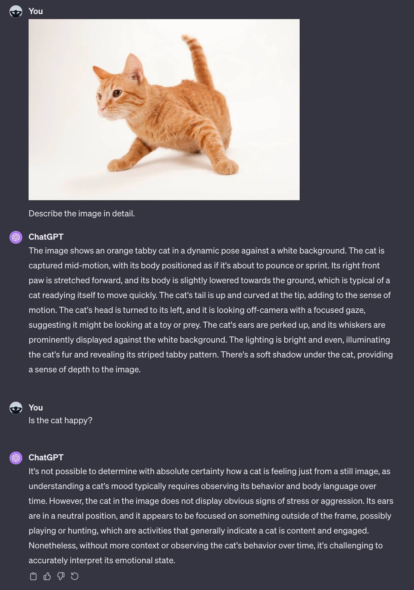

# GPT Extractor - Chrome Extension

A simple extension to export current GPT-4 conversation to a JSON file


## Sample output




```javascript
{
  "messages": [
    {
      "authorRole": "user",
      "messageId": "aaa2b09f-0ea1-4f8d-8162-68dc7d2c0432",
      "content": {
        "textContent": "  Describe the image in detail.",
        "messageImages": [
          {
            "alt": "Uploaded image",
            "src": "https://files.oaiusercontent.com/file-OjjW6XP1uXUwpNaSuFDuoyWg?se=2023-11-25T19%3A50%3A55Z&sp=r&sv=2021-08-06&sr=b&rscc=max-age%3D3599%2C%20immutable&rscd=attachment%3B%20filename%3Dcatimage.jpg&sig=dCnq44I3QolbzfTOyS2SeKWVBbdfBohFP72YVyfIW2I%3D",
            "width": 512,
            "height": 341
          }
        ]
      }
    },
    {
      "authorRole": "assistant",
      "messageId": "0e05fd41-d09f-4817-8fd1-23de4dd17c4e",
      "content": {
        "textContent": "The image shows an orange tabby cat in a dynamic pose against a white background. The cat is captured mid-motion, with its body positioned as if it's about to pounce or sprint. Its right front paw is stretched forward, and its body is slightly lowered towards the ground, which is typical of a cat readying itself to move quickly. The cat's tail is up and curved at the tip, adding to the sense of motion. The cat's head is turned to its left, and it is looking off-camera with a focused gaze, suggesting it might be looking at a toy or prey. The cat's ears are perked up, and its whiskers are prominently displayed against the white background. The lighting is bright and even, illuminating the cat's fur and revealing its striped tabby pattern. There's a soft shadow under the cat, providing a sense of depth to the image. The image shows an orange tabby cat in a dynamic pose against a white background. The cat is captured mid-motion, with its body positioned as if it's about to pounce or sprint. Its right front paw is stretched forward, and its body is slightly lowered towards the ground, which is typical of a cat readying itself to move quickly. The cat's tail is up and curved at the tip, adding to the sense of motion. The cat's head is turned to its left, and it is looking off-camera with a focused gaze, suggesting it might be looking at a toy or prey. The cat's ears are perked up, and its whiskers are prominently displayed against the white background. The lighting is bright and even, illuminating the cat's fur and revealing its striped tabby pattern. There's a soft shadow under the cat, providing a sense of depth to the image.",
        "messageImages": []
      }
    },
    {
      "authorRole": "user",
      "messageId": "aaa22e72-c819-4bf8-9847-446b70f342ea",
      "content": {
        "textContent": "Is the cat happy?",
        "messageImages": []
      }
    },
    {
      "authorRole": "assistant",
      "messageId": "212f6076-d534-4726-b456-30c61e1ce242",
      "content": {
        "textContent": "It's not possible to determine with absolute certainty how a cat is feeling just from a still image, as understanding a cat's mood typically requires observing its behavior and body language over time. However, the cat in the image does not display obvious signs of stress or aggression. Its ears are in a neutral position, and it appears to be focused on something outside of the frame, possibly playing or hunting, which are activities that generally indicate a cat is content and engaged. Nonetheless, without more context or observing the cat's behavior over time, it's challenging to accurately interpret its emotional state. It's not possible to determine with absolute certainty how a cat is feeling just from a still image, as understanding a cat's mood typically requires observing its behavior and body language over time. However, the cat in the image does not display obvious signs of stress or aggression. Its ears are in a neutral position, and it appears to be focused on something outside of the frame, possibly playing or hunting, which are activities that generally indicate a cat is content and engaged. Nonetheless, without more context or observing the cat's behavior over time, it's challenging to accurately interpret its emotional state.",
        "messageImages": []
      }
    }
  ]

```
